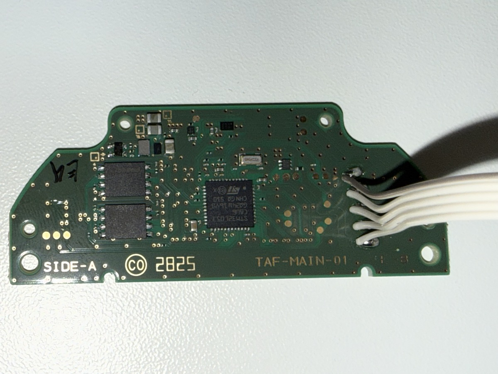
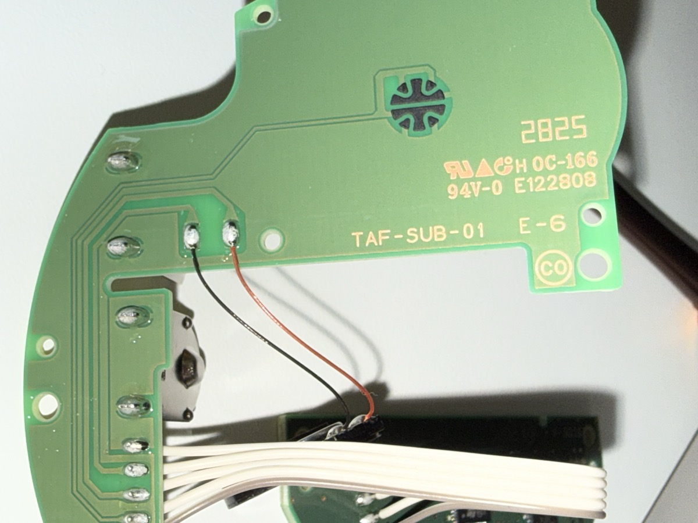
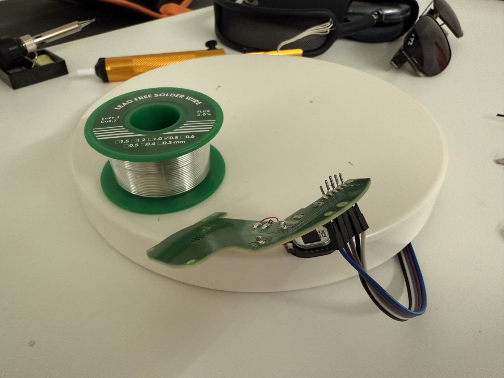
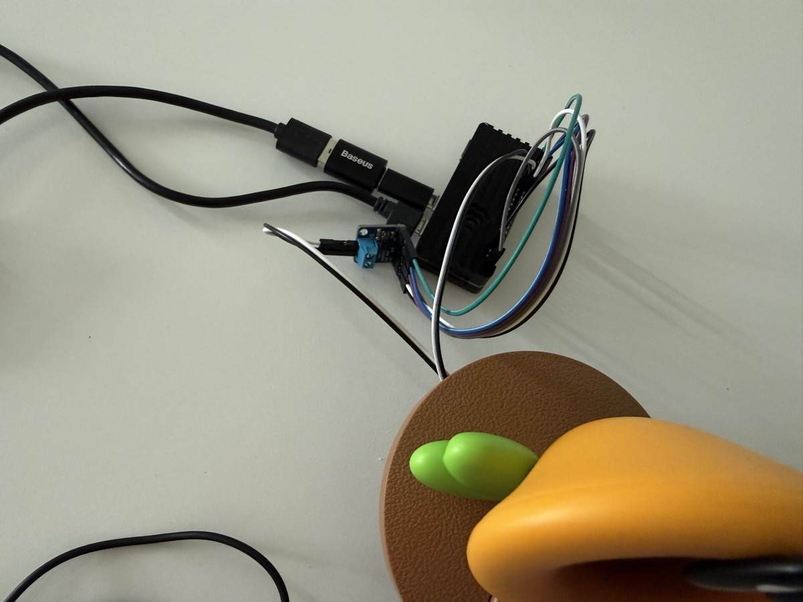

# Talking Flower

Turn a Nintendo Talking Flower toy into an AI-powered voice assistant using a Raspberry Pi Zero 2 W.

Press the button on the flower, say something, and it responds in character — as a sassy, jealous, attention-hungry Talking Flower from Super Mario Bros. Wonder. It has attitude, gets jealous of Alexa, and guilt-trips you when you ignore it.

<p align="center">
  <a href="https://youtu.be/njyr6QNPWzk">
    
  </a>
  <br>
  <a href="https://youtu.be/njyr6QNPWzk">Watch the demo on YouTube</a>
</p>

## One Button, Four Tricks

The toy's original dome switch button does everything:

| Gesture | What happens |
|---------|-------------|
| **Hold** | Push-to-talk — speak, release, get a response |
| **Tap** | Random one-liner — "You poked me!", "Boing!", "That tickles!" |
| **Double tap** | Toggle idle chatter on/off (Flowey confirms out loud) |
| **Triple tap** | Wipe conversation memory and start fresh |

15 pre-recorded quips on tap. Flowey chatters on his own every few minutes when idle — just like the flowers in Wonder. 28 pre-recorded idle lines covering boredom, jealousy, passive-aggression, and self-hype.

## How It Works

```
Button press -> Record audio -> Speech-to-Text -> LLM -> Text-to-Speech -> Speaker
```

1. Press the physical button on the flower (the original toy button, wired to GPIO)
2. Speak — the recording is sent to ElevenLabs Scribe for transcription
3. The transcript goes to an LLM via [PicoClaw](https://github.com/sipeed/picoclaw), which manages the character persona and tool access
4. The LLM response is synthesized with ElevenLabs v3 TTS (with expressive audio tags like `[gasps]`, `[whispers]`, `[excited]`)
5. Audio plays through the toy's original speaker via an I2S amplifier

The flower has a character: **Flowey** — a sassy, opinionated little flower with a diva streak. It gasps at everything, gets jealous of other voice assistants, guilt-trips you when ignored, and makes flower puns. But underneath the attitude, it genuinely cares. Conversations persist across reboots — Flowey remembers what you told it yesterday.

## The Build

### Teardown

The toy has two PCBs connected by a ribbon cable. The main board (TAF-MAIN-01) has the original processor and is bypassed entirely. The sub-board (TAF-SUB-01) has the button (a dome switch, not a tactile switch) and speaker connections.

<p align="center">
  
  
</p>

### Soldering

The ribbon cable was desoldered from the main board, and Dupont wires were soldered directly to the sub-board pads. A multimeter was used to map each wire to its function (button, speaker, battery).

<p align="center">
  
</p>

### Assembly

The Pi Zero 2 W sits on top of the toy with an I2S amplifier (MAX98357A) driving the original 8-ohm speaker through the sub-board traces. A USB mic handles voice input for now (an INMP441 I2S MEMS mic is planned).

<p align="center">
  
</p>

## Features

- **Multi-gesture button** — hold to talk, tap for quips, double-tap toggles chatter, triple-tap resets memory
- **Pre-recorded Flowey quips** — 15 voiced one-liners on button tap ("You poked me!", "Boing!", etc.)
- **Voice activity detection** — auto-stops recording when you stop speaking
- **Sentence-pipelined TTS** — first sentence plays while the rest generate
- **ElevenLabs v3 audio tags** — `[gasps]`, `[whispers]`, `[excited]` in responses
- **Time-aware greetings** — "Good morning!" vs "Still up? Go to sleep..."
- **Idle chatter** — Flowey talks randomly when nobody's around, just like in the game
- **Character system** — personality defined in Markdown files, easy to customize
- **I2S audio output** — digital amp via GPIO, drives the toy's built-in speaker
- **Auto-start on boot** — systemd services for headless operation
- **WiFi watchdog** — auto-reconnects if WiFi drops

## Hardware

| Component | Purpose |
|-----------|---------|
| Nintendo Talking Flower toy | Enclosure, button, speaker |
| Raspberry Pi Zero 2 WH | Compute |
| MAX98357A I2S amplifier | Speaker output (DAC + amp via GPIO) |
| USB C-Media mic (temporary) | Voice input (INMP441 I2S mic planned) |
| Google AIY VoiceHAT v1 | Provides the MAX98357A breakout |

See [docs/hardware.md](docs/hardware.md) for the full wiring guide, ALSA configuration, and audio tuning notes.

### Wiring Summary

- **Button**: GPIO17 + GND (dome switch on sub-board)
- **Speaker**: MAX98357A I2S amp -> GPIO18 (BCLK), GPIO19 (LRC), GPIO21 (DIN) -> toy speaker via sub-board traces
- **Mic**: USB C-Media (card 0) — will be replaced by INMP441 on GPIO18, 19, 20

## Quick Start

### Prerequisites

- Raspberry Pi Zero 2 W (or any Pi with GPIO)
- MAX98357A I2S amplifier connected to the speaker
- [PicoClaw](https://github.com/sipeed/picoclaw) installed
- ElevenLabs API key ([elevenlabs.io](https://elevenlabs.io))

### Install

```bash
git clone https://github.com/manaporkun/talking-flower.git
cd talking-flower
chmod +x scripts/*.sh
./scripts/setup.sh
```

### Configure

```bash
cd voice-assistant
cp .env.example .env
nano .env  # Add your API keys and preferences
```

### Set Up the Character

```bash
cp character/SOUL.md ~/.picoclaw/workspace/
cp character/IDENTITY.md ~/.picoclaw/workspace/
cp character/AGENTS.md ~/.picoclaw/workspace/
cp character/USER.md.example ~/.picoclaw/workspace/USER.md
nano ~/.picoclaw/workspace/USER.md  # Personalize for your setup
```

### Run

```bash
# Start PicoClaw gateway
picoclaw gateway &

# Start the voice assistant
./scripts/start.sh
```

### Run on Boot

```bash
sudo cp systemd/picoclaw-gateway.service /etc/systemd/system/
sudo cp systemd/talking-flower.service /etc/systemd/system/
sudo systemctl daemon-reload
sudo systemctl enable picoclaw-gateway talking-flower
sudo systemctl start picoclaw-gateway talking-flower
```

## Deploying Changes

After editing character files or idle chatter lines, deploy to the Pi:

```bash
# On the Pi
cd ~/talking-flower
bash deploy.sh
```

This pulls the latest from git and syncs character files to PicoClaw's workspace. Character changes take effect immediately (read per-request). If you changed `voice_assistant.py`, restart the service:

```bash
sudo systemctl restart voice-assistant
```

For new idle chatter audio, regenerate WAVs from the updated lines and upload to `~/.picoclaw/workspace/skills/flowey-telegram-voice/idle_wav/`. The voice assistant picks up new WAV files at runtime without restart.

## Customizing the Character

The flower's personality lives in four Markdown files in PicoClaw's workspace:

| File | Purpose |
|------|---------|
| `SOUL.md` | Personality (attitude, jealousy, neglect reactions), voice rules, audio tags |
| `IDENTITY.md` | Name, description, purpose |
| `AGENTS.md` | Direct behavioral instructions |
| `USER.md` | Info about the user (location, preferences) |

Edit these to create any character — a pirate, a robot, a grumpy cat. The ElevenLabs v3 audio tags (`[whispers]`, `[laughs]`, `[gasps]`, `[excited]`, `[sarcastic]`) work with any character.

## Audio Configuration Notes

The Pi Zero 2W has some known audio quirks with the MAX98357A. See [docs/hardware.md](docs/hardware.md) for details, but the key points:

- Use `dtoverlay=max98357a` (not `googlevoicehat-soundcard`)
- Output **mono** audio — the toy has a single speaker; stereo causes artifacts
- Use ALSA `softvol` to tame the Pi Zero 2W's over-amplification
- A background silence stream keeps the I2S clock alive (prevents amp power-on pop)
- USB mic needs max capture volume (+23dB) and AGC enabled

## Project Structure

```
talking-flower/
├── voice-assistant/
│   ├── voice_assistant.py       # Main application
│   ├── idle_chatter.py          # Random idle lines + time greetings
│   ├── .env.example             # Config template
│   ├── requirements.txt
│   └── sounds/
│       ├── thinking/            # Filler sounds while LLM is processing
│       ├── quips/               # One-liners for button tap Easter eggs
│       └── indicators/          # Toggle confirmation sounds
├── deploy.sh                    # Pull git + sync character files to Pi
├── character/
│   ├── SOUL.md                  # Flowey's personality
│   ├── IDENTITY.md              # Character identity
│   ├── AGENTS.md                # Behavioral instructions
│   └── USER.md.example          # User info template
├── scripts/
│   ├── setup.sh                 # Install dependencies
│   ├── start.sh                 # Launch everything
│   ├── wifi-watchdog.sh         # Auto-reconnect WiFi
│   └── cleanup.sh               # Log rotation + session cleanup
├── systemd/
│   ├── picoclaw-gateway.service
│   └── talking-flower.service
└── docs/
    ├── hardware.md              # Wiring guide + audio config
    └── images/                  # Build photos
```

## Configuration

All config is in `voice-assistant/.env`:

| Variable | Default | Description |
|----------|---------|-------------|
| `STT_PROVIDER` | `elevenlabs` | `elevenlabs` or `openai` |
| `ELEVENLABS_MODEL_ID` | `eleven_v3` | TTS model |
| `PICOCLAW_MODEL` | `kimi-turbo` | LLM model name in PicoClaw |
| `INPUT_MODE` | `auto` | `gpio`, `keyboard`, or `auto` |
| `GPIO_BUTTON_PIN` | `17` | GPIO pin for physical button |
| `SILENCE_DURATION` | `1.5` | Seconds of silence before auto-stop |
| `IDLE_CHATTER` | `1` | Enable random idle comments |
| `STARTUP_MESSAGE` | | What Flowey says on boot (or auto time-greeting) |

See `.env.example` for the complete list.

## Related

This project contributed an [ElevenLabs TTS skill](https://github.com/sipeed/picoclaw/pull/1905) upstream to PicoClaw, enabling any PicoClaw agent to use ElevenLabs text-to-speech.

## License

MIT
